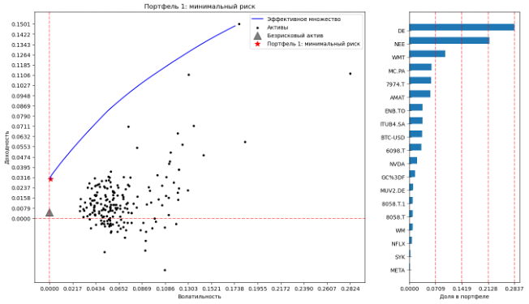
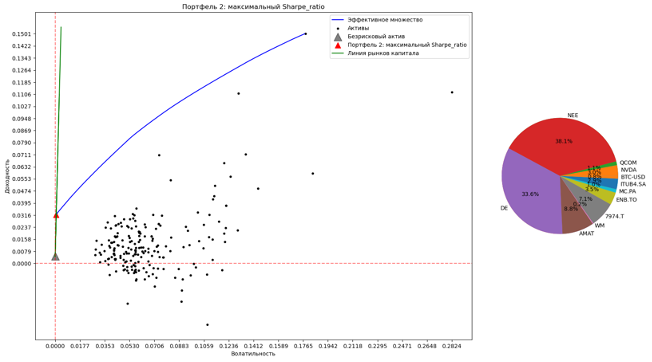
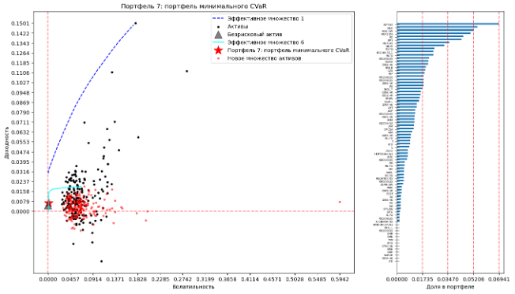
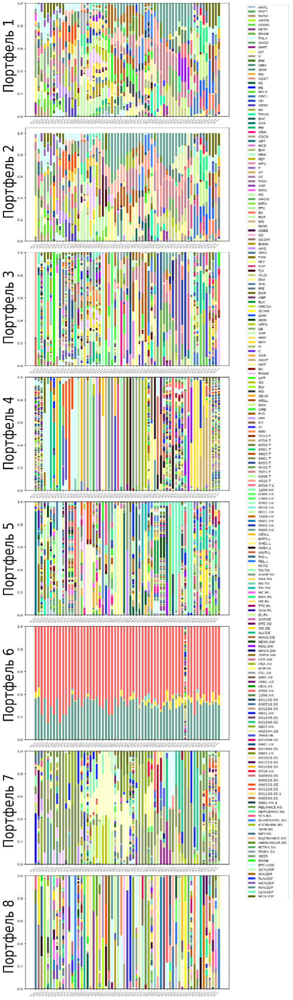

# Master's Thesis — Artificial Intelligent In Portfolio Construction & Risk Management Using Copulas (2016–2021)

This folder contains materials for my Master's thesis focused on **building and comparing portfolio construction strategies** using a mix of:
- classical Modern Portfolio Theory (Markowitz / Tobin-style optimization),
- alternative objective functions (Sharpe / Treynor / Sortino / Stutzer),
- tail-risk measures (VaR / CVaR),
- and machine-learning models for forecasting and dependency estimation.

---

## 1) Data & Experimental Setup

### Investment horizon & split
- **Horizon:** 2016-01-01 → 2021-12-31  
- **Frequency:** daily close  
- **Base currency:** USD  
- **Train:** 2016  
- **Validation:** 2017–2018  
- **Test:** 2019–2021  
- **Rebalancing:** monthly (rolling windows), **61 periods**

### Asset universe
- **200 assets** selected to reflect global market capitalization structure (country/market buckets)
- Plus **7 commodity futures**: Gold, Silver, Copper, Platinum, Palladium, WTI Oil, Natural Gas

**Market allocation (assets count):**

| Market | Share | # Assets |
|---|---:|---:|
| USA | 48% | 96 |
| Japan | 6% | 12 |
| Hong Kong | 5% | 10 |
| UK | 3% | 7 |
| Canada | 3% | 6 |
| France | 2% | 6 |
| Germany | 2% | 5 |
| Switzerland | 2% | 5 |
| Australia | 2% | 4 |
| Netherlands | 1% | 2 |
| China | 13% | 26 |
| India | 4% | 9 |
| Brazil | 1% | 2 |
| Russia | 1% | 2 |
| Crypto | 3% | 1 |

---

## 2) Portfolio Specifications

Eight portfolio approaches were built by combining:
- **objective function** (what we optimize),
- **expected return** estimation,
- **risk/variance** estimation,
- **dependency/correlation** estimation.

| # | Optimization Objective | Expected Return | Risk Estimation | Dependency Modeling |
|---:|---|---|---|---|
| 1 | Minimum variance | Moments | Moments | Pearson |
| 2 | Max Sharpe ratio | Moments | Moments | Pearson |
| 3 | Max Treynor ratio | MLE | MAD | Spearman |
| 4 | Max Sortino ratio | CAPM | Semi-variance | Kendall |
| 5 | Max Stutzer ratio | ARMA | MLE | Archimedean copulas |
| 6 | Min VaR (delta-normal) | LSTM | Kernel density | Glasso + Gaussian copula |
| 7 | Min VaR (historical) | CNN | GARCH | kPCA + elliptical copulas |
| 8 | Max return / CVaR (Monte Carlo) | XGBoost | LightGBM | Autoencoder + elliptical copulas |

---

## 3) Example Portfolios (weights)

### Portfolio 1 — Minimum Variance

### Portfolio 2 — Max Sharpe

### Portfolio 8 — Max return / CVaR

---

## 4) Results

The strategies were evaluated over 61 rolling periods with monthly rebalancing.

### Total capital growth (2016–2021)

| Portfolio | Capital growth |
|---:|---:|
| 1 | **319.15%** |
| 2 | 267.23% |
| 3 | 139.64% |
| 4 | 271.21% |
| 5 | 285.68% |
| 6 | 100.82% |
| 7 | 162.31% |
| 8 | 113.43% |

**Main takeaway:** the simplest baseline (**Portfolio 1: minimum variance**) achieved the highest total capital growth in this backtest.

---

## Notebooks / Code

The original implementation and experiments are provided as notebooks in the project (see repo root).  
Typical files referenced in the thesis:
- `data_collecting.ipynb`
- `initial_portfolios.ipynb`
- `correlation_analysis.ipynb`
- `tests.ipynb`